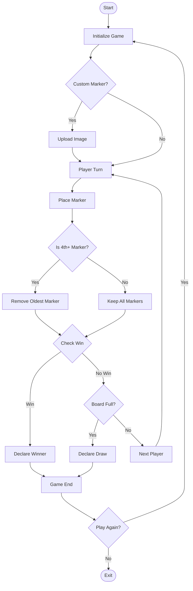

```mermaid
graph TD
    A([Start]) --> B[Initialize Game]
    B --> C{Custom Marker?}

    C -->|Yes| D[Upload Image]
    D --> E[Player Turn]
    C -->|No| E

    E --> F[Place Marker]
    F --> G{Is 4th+ Marker?}

    G -->|Yes| H[Remove Oldest Marker]
    G -->|No| I[Keep All Markers]

    H --> J{Check Win}
    I --> J

    J -->|Win| K[Declare Winner]
    J -->|No Win| L{Board Full?}

    L -->|Yes| M[Declare Draw]
    L -->|No| N[Next Player]
    N --> E

    K --> O[Game End]
    M --> O
    O --> P{Play Again?}

    P -->|Yes| B
    P -->|No| Q([Exit])
```